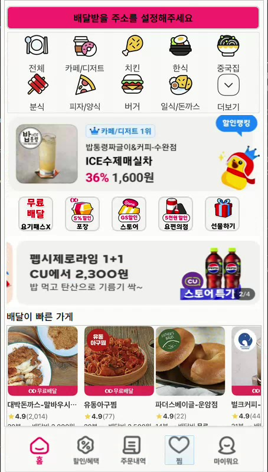
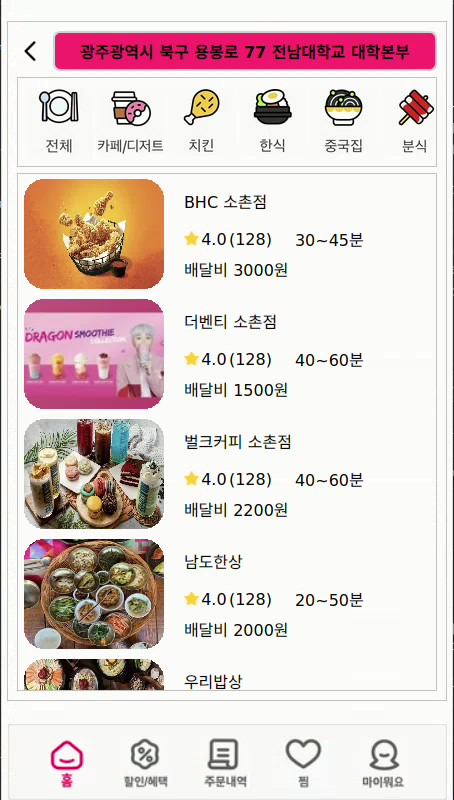
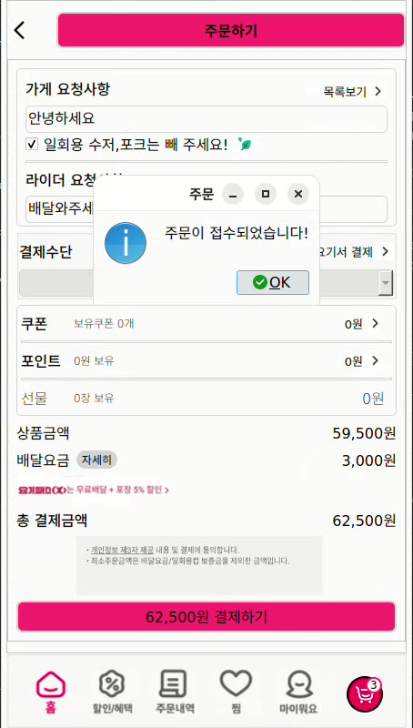
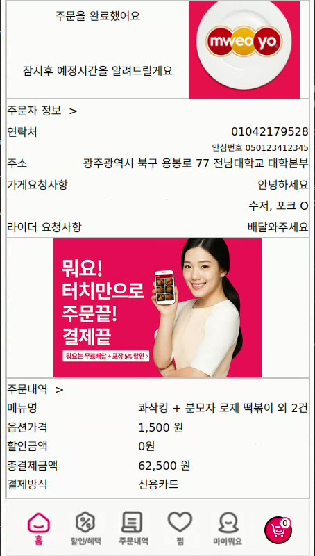
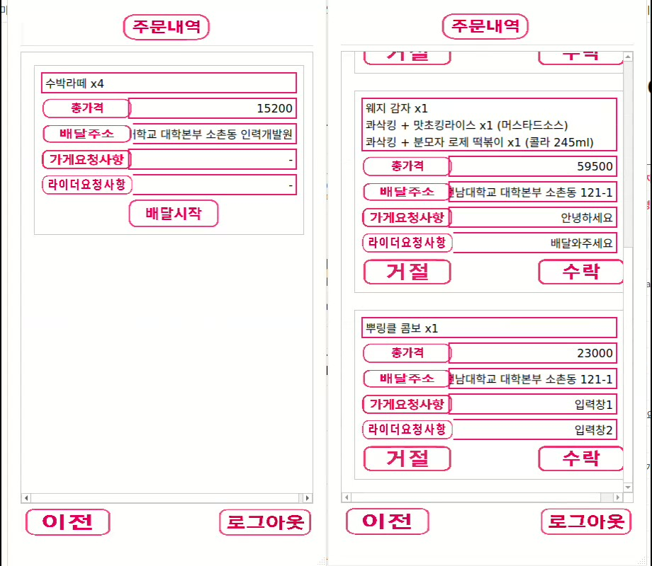
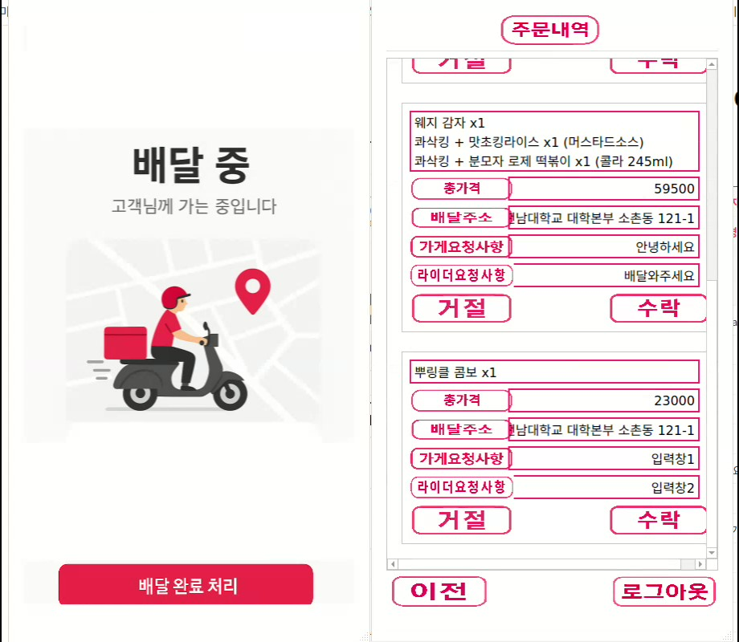

## WHAT DELIVERY

**팀원:** 하진영, 한현희, 선서현, 박은비  
**프로젝트:** 요기요 스타일의 배달 애플리케이션 클론 프로젝트  
**진행 기간:** 25년 06월 10일 ~ 25년 06월 21일

---

## 목표  
- 실제 배달앱의 구조와 기능을 분석하여, 이를 C++ 기반으로 클론 제작
- 회원, 가맹점주, 라이더의 역할을 구분하여 통합된 배달 주문 시스템 구현
- 클라이언트 - 서버 - DB 연동을 통한 주문 처리 및 데이터 관리

---

## 역할 분담
- **한현희:** 팀장 / 사장님 프로그램 (주문 관리, 가게 정보 관리) 개발
- **하진영:** DB 설계 및 구현 / TCP 서버 개발 / 라이더 프로그램 개발
- **선서현:** 회원 프로그램 개발 / 클라이언트 코드 통합 및 관리
- **박은비:** 회원 프로그램 개발 / 클라이언트 GUI 설계 및 개발

---

## 기술 스택
- OS: Linux
- C++
- QT
- TCP/IP
- MARIADB

---

## 주요 기능  

### 공통 기능  
- 사용자 로그인 / 회원가입  
- 주소 추가, 삭제, 수정 및 기본 주소 설정  
- 주소에 따른 가게 리스트 필터링 및 표시  

### 회원 클라이언트 기능  
- 메뉴 리스트 및 상세 보기  
- 옵션 선택 및 수량 조절 기능  
- 장바구니 추가 및 총 금액 자동 계산  
- 주문 요청 및 결제 화면 처리  
- 주문 내역 확인 및 재주문 기능  
- 사용자 리뷰 등록  

### 사장님 프로그램 (서버/관리용)  
- 사장님 계정 로그인 후 본인 가게의 주문 확인  
- 배달 상태 변경 처리 (예: 접수, 조리중, 배달중, 완료)  

### 라이더 클라이언트 (기획 포함)  
- 배달 목록 조회  
- 배달 상태 업데이트 기능  
  - 배달 완료 버튼을 통한 주문 상태 변경 가능  

---

## 통신 프로토콜 정의

### 회원 클라이언트

| 프로토콜            | 통신 방향   | 기능              | 설명             |
| --------------- | ------- | --------------- | -------------- |
| `1_0`           | 회원 → 서버 | 로그인 요청          | 아이디, 비밀번호 전달   |
| `1_1` / `1_2`   | 서버 → 회원 | 로그인 응답          | 로그인 성공 / 실패    |
| `5_0`           | 회원 → 서버 | 맞춤 추천 가게 요청     | 회원 주문 정보 전달    |
| `5_1` / `5_2`   | 서버 → 회원 | 맞춤 추천 가게 응답     | 추천 가게 정보 전달    |
| `6_0`           | 회원 → 서버 | 비슷한 사용자 추천 요청   | 회원 주문 정보 전달    |
| `6_1` / `6_2`   | 서버 → 회원 | 비슷한 사용자 추천 응답   | 추천 사용자 정보 전달   |
| `7_0`           | 회원 → 서버 | 주소 설정 요청        | UID 전달         |
| `7_1` / `7_2`   | 서버 → 회원 | 주소 정보 응답        | 주소 정보 전달       |
| `8_0`           | 회원 → 서버 | 주소 추가 요청        | 주소 정보 전달       |
| `8_1` / `8_2`   | 서버 → 회원 | 주소 추가 응답        | 주소 추가 완료 응답    |
| `9_0`           | 회원 → 서버 | 주소 삭제 요청        | 주소 삭제 정보 전달    |
| `9_1` / `9_2`   | 서버 → 회원 | 주소 삭제 응답        | 주소 삭제 완료 응답    |
| `21_0`          | 회원 → 서버 | 가게 선택 요청        | 가게 정보 요청       |
| `21_1` / `21_2` | 서버 → 회원 | 가게 정보 응답        | 가게 정보 전달       |
| `22_0`          | 회원 → 서버 | 카테고리별 가게 리스트 요청 | 카테고리 정보 전달     |
| `22_1` / `22_2` | 서버 → 회원 | 카테고리별 가게 리스트 응답 | 카테고리별 가게 정보 전달 |
| `10_0`          | 회원 → 서버 | 주문 내역 요청        | 회원 주문 정보 요청    |
| `10_1`          | 서버 → 회원 | 주문 내역 응답        | 주문 정보 전달       |
| `10_2`          | 서버 → 회원 | 주문 정보 갱신 실패     | 실패 알림          |
| `23_0`          | 회원 → 서버 | 찜 요청            | 가게 정보 전달       |
| `23_1` / `23_2` | 서버 → 회원 | 찜 응답            | 찜 완료 응답        |
| `24_0`          | 회원 → 서버 | 마이요기요 요청        | 회원 정보 전달       |
| `24_1` / `24_2` | 서버 → 회원 | 마이요기요 응답        | 회원 정보 전달       |
| `25_0`          | 회원 → 서버 | 주문 완료 후 요청      | 주문 정보 전달       |

### 사장님 프로그램

| 프로토콜    | 통신 방향    | 기능           | 설명              |
| ------- | -------- | ------------ | --------------- |
| `100_0` | 사장님 → 서버 | 로그인 요청       | 아이디, 비밀번호 전달    |
| `100_1` | 서버 → 사장님 | 로그인 성공       | 성공 알림           |
| `100_2` | 서버 → 사장님 | 로그인 실패       | 실패 알림           |
| `101_0` | 사장님 → 서버 | 사장님 정보 요청    | 정보 요청           |
| `101_1` | 서버 → 사장님 | 사장님 정보 응답    | 사장님 정보 전달       |
| `102_0` | 사장님 → 서버 | 영업 시간 요청     | 정보 요청           |
| `102_1` | 서버 → 사장님 | 영업 시간 응답     | 영업 시간 정보 전달     |
| `102_2` | 사장님 → 서버 | 영업 시간 변경 요청  | 변경 요청           |
| `102_3` | 서버 → 사장님 | 영업 시간 변경 완료  | 변경 완료 알림        |
| `104_0` | 사장님 → 서버 | 배달료 정보 요청    | 정보 요청           |
| `104_1` | 서버 → 사장님 | 배달료 정보 응답    | 배달료 정보 전달       |
| `104_2` | 사장님 → 서버 | 배달료 정보 변경 요청 | 변경 요청           |
| `104_3` | 서버 → 사장님 | 배달료 변경 완료    | 변경 완료 알림        |
| `107_0` | 사장님 → 서버 | 휴무일 정보 요청    | 정보 요청           |
| `107_1` | 서버 → 사장님 | 휴무일 정보 응답    | 휴무일 정보 전달       |
| `107_2` | 사장님 → 서버 | 휴무일 정보 변경 요청 | 변경 요청           |
| `107_3` | 서버 → 사장님 | 휴무일 변경 완료    | 변경 완료 알림        |
| `108_0` | 사장님 → 서버 | 할인/정산 정보 요청  | 정보 요청           |
| `108_1` | 서버 → 사장님 | 할인/정산 정보 응답  | 할인/정산 정보 전달     |
| `109_0` | 사장님 → 서버 | 원산지 정보 요청    | 정보 요청           |
| `109_1` | 서버 → 사장님 | 원산지 정보 응답    | 원산지 정보 전달       |
| `109_2` | 사장님 → 서버 | 원산지 변경 요청    | 변경 요청           |
| `109_3` | 서버 → 사장님 | 원산지 변경 완료    | 변경 완료 알림        |
| `110_0` | 사장님 → 서버 | 자주 묻는 질문 요청  | 정보 요청           |
| `110_1` | 서버 → 사장님 | 자주 묻는 질문 응답  | 정보 전달           |
| `111_0` | 사장님 → 서버 | 추천 정보 요청     | 추천 정보 요청        |
| `111_1` | 서버 → 사장님 | 추천 정보 응답     | 추천 정보 전달        |
| `112_0` | 사장님 → 서버 | 맞춤 팁 요청      | 맞춤 팁 요청         |
| `112_1` | 서버 → 사장님 | 맞춤 팁 응답      | 맞춤 팁 전달         |
| `113_0` | 사장님 → 서버 | 회원 주문 정보 요청  | 주문 정보 요청        |
| `113_1` | 사장님 → 서버 | 주문 수락 전송     | 주문 수락, 라이더에게 전달 |
| `113_2` | 사장님 → 서버 | 주문 거절 전송     | 주문 거절 알림        |

### 라이더 프로그램
| 프로토콜                | 통신 방향    | 기능       | 설명              |
| ------------------- | -------- | -------- | --------------- |
| `1000_0`            | 라이더 → 서버 | 로그인 요청   | 아이디, 주문번호 전달    |
| `1000_1` / `1000_2` | 서버 → 라이더 | 로그인 응답   | 로그인 성공 / 실패     |
| `1001_0`            | 라이더 → 서버 | 업무 시작 요청 | 주문 정보 전달        |
| `1001_1`            | 서버 → 라이더 | 업무 시작 응답 | 주문 정보 전달        |
| `1002_0`            | 라이더 → 서버 | 주문 수락    | 주문 수락, 사장님에게 전달 |
| `1003_0`            | 라이더 → 서버 | 픽업 완료    | 픽업 완료, 사장님에게 전달 |
| `1004_0`            | 라이더 → 서버 | 배달 완료    | 배달 완료, 사장님에게 전달 |

---

## 데이터베이스 테이블 정의

- **RESOURCE_CATEG**  
  카테고리별 리소스 이미지 정보  
  - `CATEGORY_NAME` : 카테고리명 (PK)  
  - `IMGPATH` : 이미지 경로  

- **COUPON**  
  브랜드 / 가게 별 쿠폰 정보  
  - `BRAND_UID` : 브랜드 UID (FK)  
  - `PLACE_UID` : 가게 UID (FK)  
  - `TOTAL_DISCOUNT` : 총 할인율  
  - `ORDER_CONDITIONS` : 주문 조건  

- **COUPON_RANKING**  
  메뉴 할인 순위 정보  
  - `BRAND_UID` : 브랜드 UID (FK)  
  - `PLACE_UID` : 가게 UID (FK)  
  - `MENU_NAME` : 메뉴명  
  - `MENU_DISCOUNT` : 할인율  

- **RECENTLY_VIEWED**  
  최근 본 가게 정보  
  - `UID` : 회원 UID (FK)  
  - `BRAND_UID` : 브랜드 UID (FK)  
  - `PLACE_UID` : 가게 UID (FK)  
  - `LAST_VIEWED_AT` : 마지막 조회일  

- **USER_LIKE**  
  회원 찜 정보  
  - `UID` : 회원 UID (FK)  
  - `BRAND_UID` : 브랜드 UID (FK)  
  - `PLACE_UID` : 가게 UID (FK)  
  - `STAR_POINT` : 별점  
  - `REVIEW` : 리뷰  

- **ORDER_DETAIL**  
  주문 상세 정보  
  - `ORDER_ID` : 주문 ID (FK)  
  - `MENU_NAME` : 메뉴명  
  - `MENU_PRICE` : 메뉴 단가  
  - `MENU_CNT` : 메뉴 수량  
  - `OPT_NAME_ALL` : 옵션명  
  - `OPT_PRICE_ALL` : 옵션 가격  

- **USER_ADDRESS**  
  회원 주소 정보  
  - `UID` : 회원 UID (FK)  
  - `ADDRESS_DETAIL` : 상세 주소  
  - `ADDRESS_NAME` : 주소 명칭  
  - `ADDRESS_TYPE` : 주소 타입  
  - `ADDRESS_BASIC` : 기본 주소  

- **RIDER_INFO**  
  라이더 정보  
  - `PHONENUMBER` : 전화번호 (PK)  
  - `CITY` : 지역  
  - `VEHICLE` : 배달 수단  
  - `BIRTH` : 생년월일  
  - `ACCOUNT_NUMBER` : 계좌번호  

- **USER_COUPON**  
  회원 쿠폰 사용 정보  
  - `COUPON_NUM` : 쿠폰 번호 (PK)  
  - `UID` : 회원 UID (FK)  
  - `PASS` : 사용 여부  
  - `COUPON_NAME` : 쿠폰명  
  - `TOTAL_DISCOUNT` : 할인율  
  - `ORDER_CONDITIONS` : 조건  
  - `CP_STATUS` : 쿠폰 상태  
  - `CPNX_DATE` : 유효기간  

- **USER_REVIEW**  
  회원 리뷰 정보  
  - `REVIEW_ID` : 리뷰 ID (PK)  
  - `UID` : 회원 UID (FK)  
  - `BRAND_UID` : 브랜드 UID (FK)  
  - `PLACE_UID` : 가게 UID (FK)  
  - `ORDER_TIME` : 주문 시간  
  - `MENU` : 메뉴명  
  - `STAR_POINT` : 별점  
  - `STAR_FLAVOR` : 맛 별점  
  - `STAR_QNTY` : 양 별점  
  - `REVIEW` : 리뷰 내용  

- **ORDER_**  
  주문 정보  
  - `ORDER_ID` : 주문 ID (PK)  
  - `UID` : 회원 UID (FK)  
  - `BRAND_UID` : 브랜드 UID (FK)  
  - `PLACE_UID` : 가게 UID (FK)  
  - `ORDER_TIME` : 주문 시간  
  - `TOTAL_PRICE` : 총 금액  
  - `ADDRESS_DETAIL` : 주소  
  - `STATUS_TO_GO` : 포장 여부  
  - `STATUS_DISPOSABLE` : 일회용기 여부  
  - `STATUS_ORDER` : 주문 상태  

- **RESTAURANT_INFO**  
  가게 정보  
  - `BRAND_UID` : 브랜드 UID (PK)  
  - `PLACE_UID` : 가게 UID (PK)  
  - `OWNER_ID` : 사장님 ID (FK)  
  - `RST_NOTICE` : 공지사항  
  - `STAR_POINT` : 별점  
  - `STAR_QNTY` : 별점 수량  
  - `STAR_FLAVOR` : 맛 별점  
  - `RST_NAME` : 가게명  
  - `FRONT_IMG` : 대표 이미지  
  - `CATEGORY1` ~ `CATEGORY4` : 카테고리  

- **RST_INFO**  
  가게 기본 정보  
  - `BRAND_UID` : 브랜드 UID (FK)  
  - `PLACE_UID` : 가게 UID (FK)  
  - `OWNER_ID` : 사장님 ID (FK)  
  - `RST_NOTICE` : 공지사항  
  - `STAR_POINT` : 별점  
  - `STAR_QNTY` : 별점 수량  
  - `STAR_FLAVOR` : 맛 별점  
  - `RST_NAME` : 가게명  
  - `FRONT_IMG` : 대표 이미지  
  - `CATEGORY1` ~ `CATEGORY4` : 카테고리  

- **SEARCH_INFO**  
  검사 결과 기록 저장  
  - `NUM` : 고유 번호 (PK)  
  - `ADDTIME` : 검사 요청 시간  
  - `PHONENUMBER` : 회원 전화번호 (FK)  
  - `STATUS` : 검사 결과 (정상 / 곰팡이)  
  - `FILENAME` : 저장된 검사 이미지명  

> **SEARCH_INFO는 USER_INFO와 전화번호를 기준으로 1:N 관계**

---

## 겪었던 문제점
서버 데이터 수신 누락  
→ 클라이언트가 데이터를 전송한 후 서버에서 응답 없이 대기하는 현상 발생  
→ 서버 측에서 recv() 호출 후 패킷의 끝을 정확히 구분하지 못해 JSON 파싱 실패로 이어짐  
  
시그널-슬롯 연결 오류  
→ Qt에서 시그널과 슬롯 연결이 누락되어 UI 동작이 정상 작동하지 않거나 이벤트 처리가 안 되는 경우 발생  
  
구조체 데이터 전달 오류  
→ 구조체 멤버를 정확히 초기화하지 않거나 전달 과정에서 값이 변조되어 원하는 데이터가 전달되지 않는 문제  
  
DB 데이터 누락 및 비동기 처리 오류  
→ MariaDB에서 데이터를 정상적으로 가져오지 못하거나, 비동기 처리로 인해 동시성 문제가 발생하는 경우  
  
UI 이벤트 동작 예외 처리 미흡  
→ 옵션 선택, 수량 조절 등에서 예외 상황 발생 시 UI가 비정상 동작  
  
---

## 문제 해결 방법
패킷 종료 구분자 추가  
→ 서버에서 데이터 수신 후 끝을 구분할 수 있도록 <<END>> 종료 구분자를 추가하여 JSON 파싱 문제 해결  
  
시그널-슬롯 전수 점검 및 재연결  
→ Qt의 시그널과 슬롯 매칭을 재점검하고, 특히 동적으로 생성되는 위젯에 대해서도 연결 상태를 확인하여 동작 보장  
  
구조체 초기화 및 참조 방식 통일  
→ 구조체 선언 시 명확한 초기화  
→ 포인터와 참조 사용 구분을 철저히 하여 데이터 전달의 신뢰성 확보  
  
DB 접근 순서 및 예외 처리 강화  
→ SQL 쿼리 전후에 연결 상태를 체크하고, 예외 상황에 대비한 예외 처리 구문을 추가  
→ 비동기 처리 시 동기화 보장 및 쿼리 성공 여부를 명확히 확인  
  
UI 이벤트 예외 처리 및 방어 코드 추가  
→ 옵션 선택 및 수량 조절 버튼 등에 대한 예외 처리 강화  
→ 잘못된 입력 또는 비정상 흐름 발생 시 사용자 알림 및 기본 동작으로 복구  

---

## 📁 폴더 구조

WHAT_owner/                   # 사장님 프로그램 (Qt C++ 기반)  
├── img.qrc                   # 리소스 이미지 등록 파일  
├── main.cpp                  # 메인 실행 파일  
├── mainwindow.cpp            # 메인 윈도우 소스  
├── mainwindow.h              # 메인 윈도우 헤더  
├── mainwindow.ui             # 메인 윈도우 UI 파일  
├── orderlist_widget.cpp      # 주문 목록 위젯 소스  
├── orderlist_widget.h        # 주문 목록 위젯 헤더  
├── orderlist_widget.ui       # 주문 목록 위젯 UI 파일  
├── WHAT_owner.pro            # 프로젝트 설정 파일  
├── WHAT_owner.pro.user       # 사용자 설정 파일  
├── 📁 ii/                     # 추가 리소스 폴더  

WHAT_rider/                   # 라이더 프로그램 (Qt C++ 기반)  
├── delivery_widget.cpp       # 배달 위젯 소스  
├── delivery_widget.h         # 배달 위젯 헤더  
├── delivery_widget.ui        # 배달 위젯 UI 파일  
├── image.qrc                 # 리소스 이미지 등록 파일  
├── main.cpp                  # 메인 실행 파일  
├── mainwindow.cpp            # 메인 윈도우 소스  
├── mainwindow.h              # 메인 윈도우 헤더  
├── mainwindow.ui             # 메인 윈도우 UI 파일  
├── WHAT_rider.pro            # 프로젝트 설정 파일  
├── WHAT_rider.pro.user       # 사용자 설정 파일  
├── 📁 ii/                     # 추가 리소스 폴더  

WHAT_user/                    # 사용자 클라이언트 프로그램 (Qt C++ 기반)  
├── addressbtn.cpp            # 주소 버튼 위젯 소스  
├── addressbtn.h              # 주소 버튼 위젯 헤더  
├── addressbtn.ui             # 주소 버튼 위젯 UI 파일  
├── backup.zip                # 백업 파일  
├── dbmanager.cpp             # DB 매니저 소스  
├── dbmanager.h               # DB 매니저 헤더  
├── image.qrc                 # 리소스 이미지 등록 파일  
├── main.cpp                  # 메인 실행 파일  
├── mainwindow.cpp            # 메인 윈도우 소스  
├── mainwindow.h              # 메인 윈도우 헤더  
├── mainwindow.ui             # 메인 윈도우 UI 파일  
├── menu_head.cpp             # 메뉴 상단부 위젯 소스  
├── menu_head.h               # 메뉴 상단부 위젯 헤더  
├── menu_head.ui              # 메뉴 상단부 UI 파일  
├── menu_normal.cpp           # 기본 메뉴 위젯 소스  
├── menu_normal.h             # 기본 메뉴 위젯 헤더  
├── menu_normal.ui            # 기본 메뉴 UI 파일  
├── order_list_widget.cpp     # 주문 리스트 위젯 소스  
├── order_list_widget.h       # 주문 리스트 위젯 헤더  
├── order_list_widget.ui      # 주문 리스트 위젯 UI 파일  
├── rst_main_icon.cpp         # 메인 아이콘 위젯 소스  
├── rst_main_icon.h           # 메인 아이콘 위젯 헤더  
├── rst_main_icon.ui          # 메인 아이콘 UI 파일  
├── sel_menu_info.cpp         # 메뉴 선택 정보 위젯 소스  
├── sel_menu_info.h           # 메뉴 선택 정보 위젯 헤더  
├── sel_menu_info.ui          # 메뉴 선택 정보 UI 파일  
├── selected_menu_widget.cpp  # 선택된 메뉴 위젯 소스  
├── selected_menu_widget.h    # 선택된 메뉴 위젯 헤더  
├── selected_menu_widget.ui   # 선택된 메뉴 UI 파일  
├── struct_and_enum.h         # 구조체 및 열거형 정의  
├── WHAT.pro                  # 프로젝트 설정 파일  
├── WHAT.pro.user             # 사용자 설정 파일  
├── 📁 image/                  # 이미지 리소스 폴더  

├──restaurant_img/               # 가게 이미지 리소스 폴더  

├── README.md  

---

## 🖼️ 실행 결과

### 사용자 인터페이스
  
  
  
  

### 라이더/사장님 인터페이스
  
  
